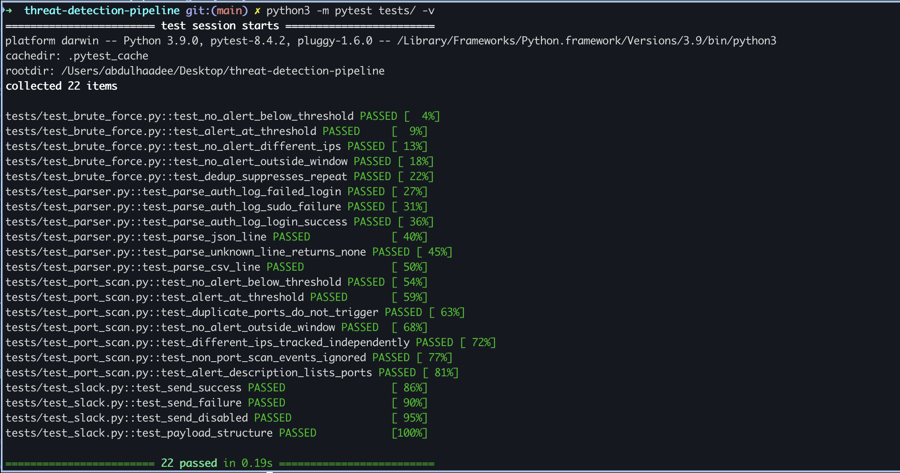
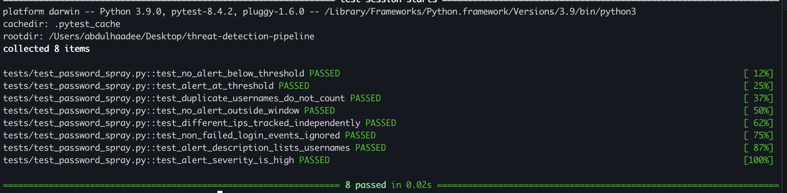
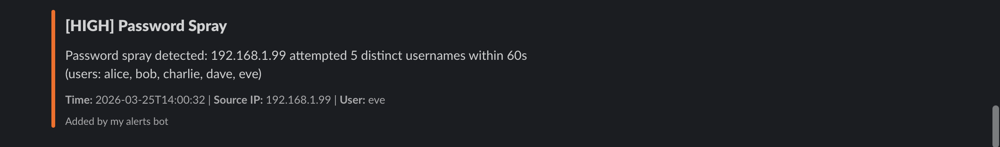
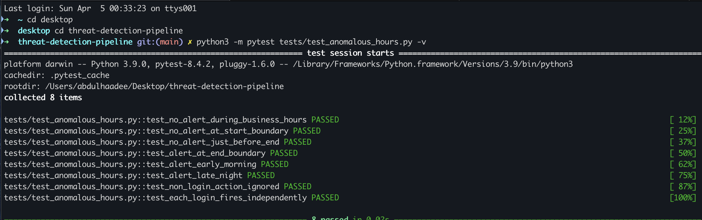
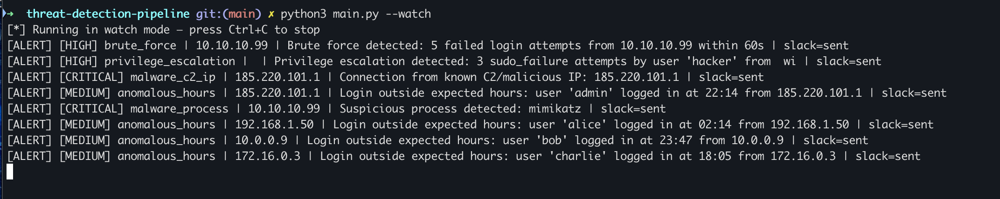
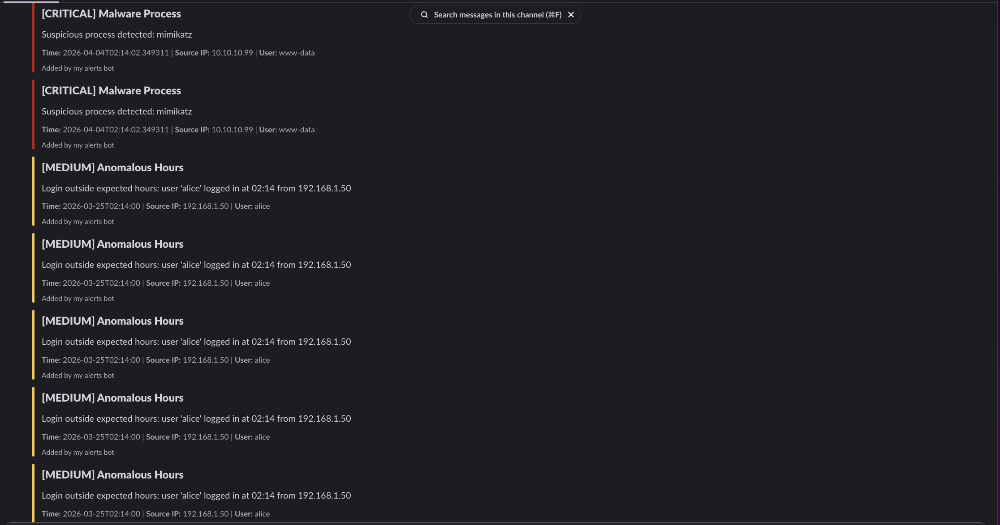
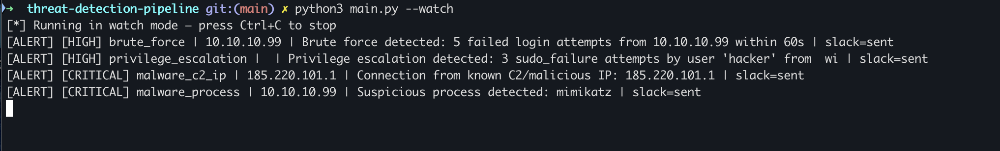
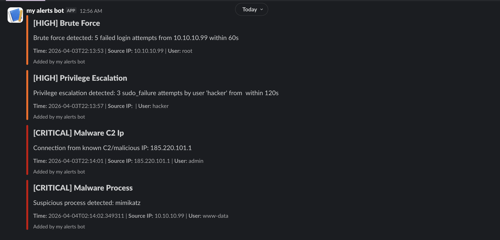
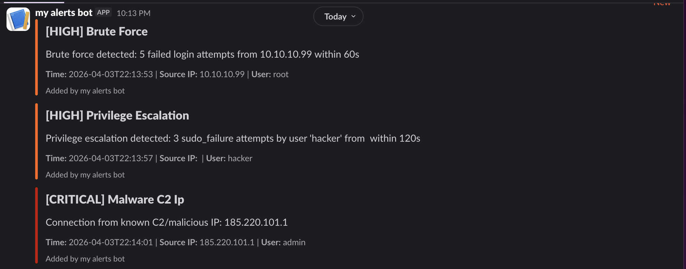
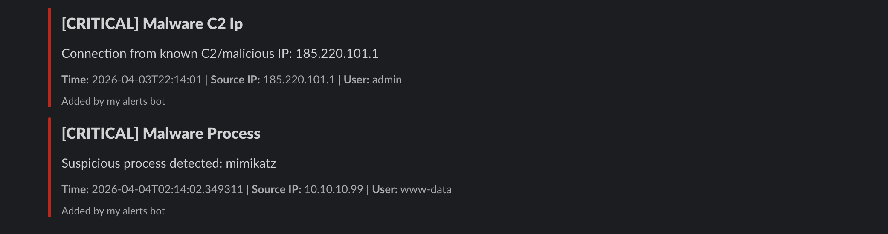

# Threat Detection & Alerting Pipeline

An automated log ingestion and threat detection pipeline that monitors system logs, detects Indicators of Compromise (IOCs), and delivers real-time Slack alerts — built to mirror real SOC analyst workflows.

## Features

- **Real-time log monitoring** — watches auth.log, system.log, and custom log files using file system events
- **Detection rules:**
  - Brute force SSH (configurable failure threshold + time window)
  - Privilege escalation (sudo/su failures per user)
  - Malware C2 IPs (blocklist matching)
  - Malicious processes (mimikatz, netcat, meterpreter, etc.)
  - Port scanning (distinct destination ports per IP within a time window)
  - Anomalous login hours (logins outside configurable working hours window)
  - Password spraying (many distinct usernames from one IP, distinct from brute force)
- **Slack alerting** — formatted Block Kit messages with severity-based color coding
- **Alert deduplication** — cooldown window prevents alert flooding
- **SQLite persistence** — every alert stored locally for audit and reporting
- **Terminal + HTML reports** — on-demand or daily scheduled summaries

## Tech Stack

Python 3.10+ · watchdog · PyYAML · python-dotenv · requests · APScheduler · SQLite · pytest

## Quick Start

```bash
# 1. Install dependencies
pip install -r requirements.txt

# 2. Configure Slack webhook
cp .env.example .env
# Edit .env and add your SLACK_WEBHOOK_URL

# 3. Run in batch mode (processes sample logs, prints report)
python3 main.py

# 4. Run in real-time watch mode
python3 main.py --watch

# 5. Generate a report on-demand
python3 main.py --report --since 24
```

## Configuration

Edit `config.yaml` to customize:

```yaml
log_paths:
  - /var/log/auth.log
  - /var/log/system.log

thresholds:
  brute_force:
    max_failures: 5
    window_seconds: 60
  privesc:
    max_attempts: 3
    window_seconds: 120
  malware:
    blocklist_ips:
      - "185.220.101.1"
    suspicious_processes:
      - "mimikatz"
      - "netcat"
```

## Project Structure

```
threat-detection-pipeline/
├── main.py                      # Entry point (batch, watch, report modes)
├── config.yaml                  # Thresholds, log paths, alerting config
├── ingestion/
│   ├── parser.py                # Normalizes auth.log, JSON, CSV → Event dicts
│   └── log_reader.py            # Batch reader + real-time watchdog watcher
├── detectors/
│   ├── base.py                  # BaseDetector + Alert TypedDict
│   ├── brute_force.py           # SSH brute force detection
│   ├── privesc.py               # Privilege escalation detection
│   ├── malware_indicators.py    # C2 IP + malicious process detection
│   ├── port_scan.py             # Port scan detection (sliding window)
│   ├── anomalous_hours.py       # Off-hours login detection
│   └── password_spray.py        # Password spray detection (many usernames, one IP)
├── alerting/
│   ├── slack_sender.py          # Slack Block Kit webhook sender
│   └── deduplicator.py          # Cooldown-based alert deduplication
├── storage/
│   └── db.py                    # SQLite alert persistence
├── reporting/
│   └── summary.py               # Terminal + HTML report generator
├── sample_logs/                 # Demo log files for testing
└── tests/                       # pytest suite (38 tests)
```

## Running Tests

```bash
pytest tests/ -v
```

## Sample Alert Output

```
[ALERT] [HIGH] brute_force | 10.10.10.99 | Brute force detected: 5 failed login attempts from 10.10.10.99 within 60s | slack=sent
[ALERT] [HIGH] privilege_escalation | user hacker | 3 sudo_failure attempts within 120s | slack=sent
[ALERT] [CRITICAL] malware_c2_ip | 185.220.101.1 | Connection from known C2/malicious IP | slack=sent
[ALERT] [CRITICAL] malware_process | mimikatz detected on 10.10.10.99 | slack=sent
[ALERT] [MEDIUM] port_scan | 45.33.32.156 | Port scan detected: probed 10 distinct ports within 30s | slack=sent
[ALERT] [MEDIUM] anomalous_hours | 192.168.1.50 | Login outside expected hours: user 'alice' logged in at 02:14 from 192.168.1.50 | slack=sent
[ALERT] [HIGH] password_spray | 192.168.1.99 | Password spray detected: 192.168.1.99 attempted 5 distinct usernames within 60s | slack=sent
```

## Screenshots

### All Tests Passing
30 tests across all detectors and alerting components — run with `pytest tests/ -v`.



### Password Spray Detection — Tests Passing
All 8 tests for the password spray detector passing, covering threshold boundaries, duplicate username handling, time window expiry, independent IP tracking, and correct HIGH severity classification.



### Password Spray Detection — Slack Alert
HIGH severity alert delivered to Slack showing the attacker IP, number of distinct usernames attempted, and the full list of targeted accounts — giving a SOC analyst everything needed to investigate a credential stuffing attempt.



### Anomalous Login Hours — Tests Passing
All 8 tests for the anomalous hours detector passing, covering business hours boundaries, early morning and late night logins, wrong action types, and independent tracking per user.



### Anomalous Login Hours — Terminal Output
Watch mode output showing the detector firing on three off-hours logins: alice at 02:14, bob at 23:47, and charlie at 18:05. Two normal business-hours logins in the same log file produce no alerts.



### Anomalous Login Hours — Slack Alerts
MEDIUM severity alerts delivered to Slack in real time. Each alert includes the username, exact login time, and source IP — giving a SOC analyst everything needed to investigate quickly.



### Port Scan Detection — Terminal Output
Live terminal output showing the port scan detector firing as a suspicious IP probes 10 distinct ports within 30 seconds.



### Slack Alerts — Real-Time Notifications
Alerts delivered to Slack in real time with severity-based formatting. Each alert includes the rule name, source IP, and a human-readable description.



### Slack Alerts Overview (Legacy)


### Critical Malware Detection


## Author

Abdul Haadee Alam — Cybersecurity Student | SOC Analyst  
[GitHub](https://github.com/alamabdulhaadee-sudo) · [LinkedIn](https://linkedin.com/in/abdulhaadeealam)
